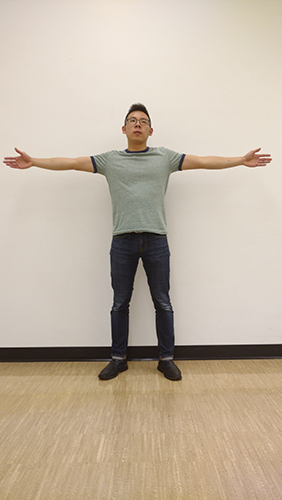
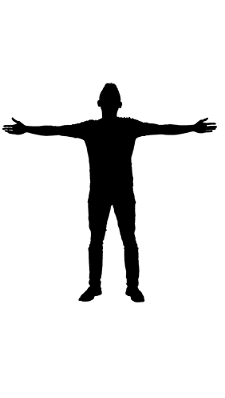
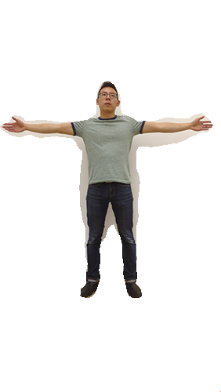
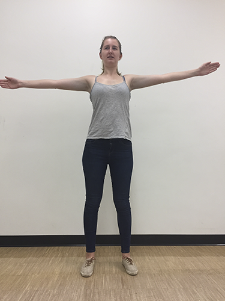
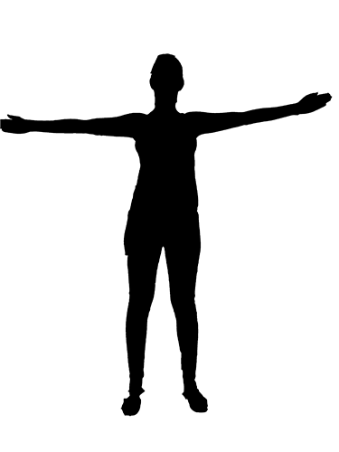
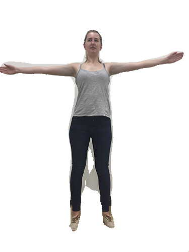
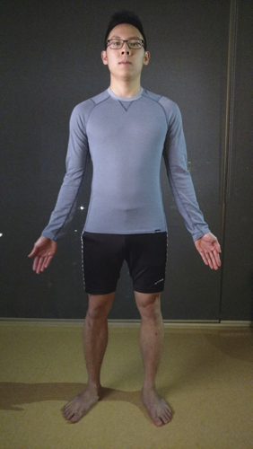
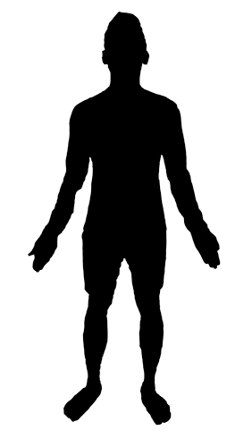
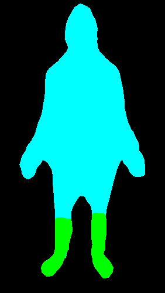
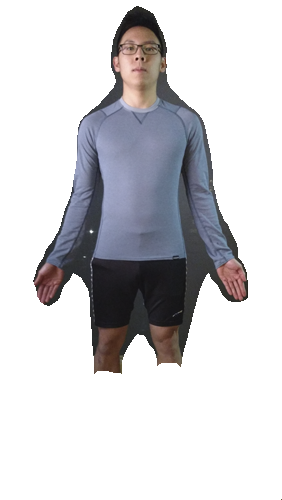

This repository is an implementation of the paper [Fully Convolutional Networks for Semantic Segmentation](https://people.eecs.berkeley.edu/~jonlong/long_shelhamer_fcn.pdf) for the purpose of segmenting humans from a singular RGB image.

Tested with...
- Ubuntu 16.04.01 LTS running on VirtualBox with 5551 MB Memory, 2 Processor Cores, 35 GB Storage, Hyper-V acceleration
- Intel i7-4510U CPU @ 2.00 GHz 2.60 GHz)
- Caffe 1.0.0-rc3
- Python 3.5.3
- OpenCV 3.1.0

Algorithm
---

- Preprocess test image by downsizing to a maximum of 750px (hardware limitation) and apply CLAHE histogram equalization
- Run test image through the FCN network to obtain a prediction numpy array, corresponding to a pixel-wise prediction of classes
- Iterate through the prediction array and original test image together. 
    - Using the VOC 2012 class definitions, if the prediction array contains a value that is not classified as 'PERSON', white out all 3 colour channels on the original image ("discarding" it)
- Compute precision, recall, and F1 scores on the final segmented image by comparing it to a ground truth image

Qualitative Results
---

Issues & Limitations
---

- Bare legs are incorrectly classified as "horse" category

- The above system specifications was not powerful enough to handle input images larger than a certain dimension (around 750x750px).

- `Check failed: *ptr host allocation of size xxxxx failed` : check memory availability of system

- `blob size exceeds INT_MAX` : [limitation of HDF5DataLayer](https://github.com/BVLC/caffe/issues/3084). Could possibly do with image dimensions that are too large for the net to handle 

- `killed` : most probable cause is system running out of RAM or GPU memory. Reducing batch size may be a fix, or increasing memory / computation resource of system, or rescaling image to be smaller

USAGE
----

1. In src/, download the .caffemodel file from the URL included in src/caffemodel-url. Place the .caffemodel file in src/
2. Sequentially label your test images and put them in images/test
3. Put your corresponding truth images for your test images in images/truth
    - The filenames for the test and truth must be identical    

Run `python eval.py /images [clipSize]`
- [clipSize] of the CLAHE preprocessing step. Input '0' to skip this step.

Output:
- images/seg: segmented images
- images/npy: npy files corresponding to prediction
- images/labelled: colour labelled images 
- images/mask: black mask for human labels
- scores.txt: precision, recall and f1 results for this test set

